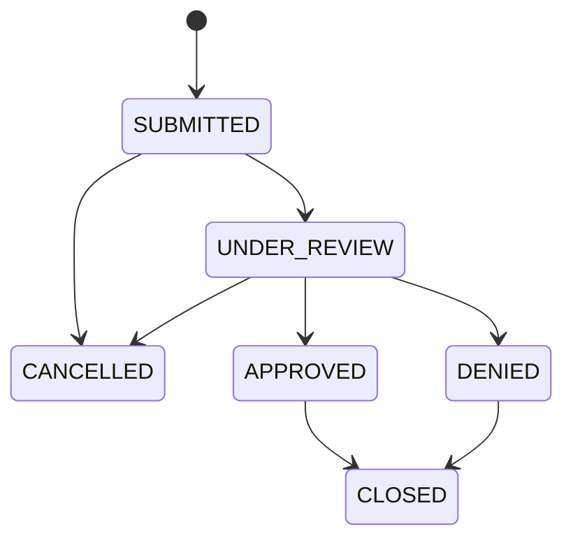

# Insurance Claims Integration Platform

A production-style learning project for submitting and processing synthetic insurance claims through REST APIs, PostgreSQL, RabbitMQ, and an AI-assisted review worker.

> This project uses synthetic data only. The AI component will summarize claim information and flag missing details for a human reviewer. It must never approve, deny, price, or determine coverage for a claim.

## Current edition

This edition includes the Spring Boot claims-service foundation, its framework-independent claim domain model, HTTP endpoints for submitting and browsing synthetic claims, and durable PostgreSQL persistence managed by Flyway.

## Claim lifecycle



`CANCELLED` and `CLOSED` are terminal states. The domain model rejects every transition not shown above. Domain validation keeps these rules consistent regardless of whether a claim operation originates from REST, messaging, or a future administrative process.

## Repository layout

```text
services/
  claims-service/    Spring Boot REST API and claims orchestration
```

Additional services, the Python worker, and the React portal will be added only when their milestones begin.

## Prerequisites

- Java 17
- Docker Desktop with Docker Compose
- Node.js 24 LTS (for the later frontend milestone)
- Python 3.12 and uv (for the later worker milestone)

Maven does not need to be installed globally. The claims service includes Maven Wrapper, which downloads and uses the project's configured Maven version.

## Build and test the claims service

Docker Desktop must be running because the persistence integration test starts a
disposable PostgreSQL container with Testcontainers.

```bash
cd services/claims-service
./mvnw test
```

## Run and manually verify the claims service

Create your ignored local environment file and choose a local-only database
password:

```bash
cp .env.example .env
```

Edit `.env`, replace `replace-with-a-local-password`, and then start PostgreSQL:

```bash
docker compose up --detach --wait postgres
```

Docker Compose reads `.env` automatically. Export the same variables for the Java
process, then start the application:

```bash
set -a
source .env
set +a
cd services/claims-service
./mvnw spring-boot:run
```

In a second terminal, request its health status:

```bash
curl --fail --silent http://localhost:8080/actuator/health
```

Expected response:

```json
{"groups":["liveness","readiness"],"status":"UP"}
```

The readiness probe can be checked independently at
`http://localhost:8080/actuator/health/readiness`. A platform such as Docker or
Kubernetes can use this signal to decide whether the service is ready to receive
traffic.

When finished, stop PostgreSQL from the repository root with `docker compose down`.
The named volume keeps the data for the next run. Running
`docker compose down --volumes` also deletes the local database and should only be
used when you intentionally want a clean reset.

## Submit a synthetic claim

With the claims service running, submit a claim from a second terminal:

```bash
curl --include \
  --request POST \
  --header 'Content-Type: application/json' \
  --header 'X-Correlation-ID: local-demo-1001' \
  --data '{
    "externalReference": "EXT-DEMO-1001",
    "policyNumber": "POL-2001",
    "claimantName": "Synthetic Claimant",
    "claimType": "AUTO",
    "incidentDate": "2026-01-10",
    "description": "Synthetic vehicle damage for local testing",
    "estimatedLoss": 1250.00
  }' \
  http://localhost:8080/api/v1/claims
```

The response is `201 Created`, includes a `Location` header, and returns the new
claim with status `SUBMITTED`. Reusing the external reference, even with different
letter casing, returns `409 Conflict` as an RFC 9457 Problem Details response.

Claims are stored in PostgreSQL and remain available after the claims-service or
database container restarts. Flyway applies versioned schema migrations at startup,
while Hibernate validates that the JPA mapping still agrees with the migrated
schema. PostgreSQL also enforces case-insensitive external-reference uniqueness.

## Retrieve and browse claims

Use the `id` returned by claim submission to retrieve that claim:

```bash
curl --silent \
  --header 'X-Correlation-ID: local-demo-get-1001' \
  http://localhost:8080/api/v1/claims/{id}
```

An unknown claim ID returns `404 Not Found` as a Problem Details response. Browse
claims with zero-based pagination and optional `status` and `claimType` filters:

```bash
curl --silent \
  'http://localhost:8080/api/v1/claims?page=0&size=20&status=SUBMITTED&claimType=AUTO'
```

The default page is `0`, the default size is `20`, and the maximum size is `100`.
Results are ordered newest first. The response includes `totalElements` and
`totalPages` so clients can build pagination controls without loading every claim.

## Transition claim status and view history

Request a lifecycle transition with the claim ID returned by submission:

```bash
curl --silent \
  --request PATCH \
  --header 'Content-Type: application/json' \
  --header 'X-Correlation-ID: local-status-1001' \
  --data '{"status":"UNDER_REVIEW"}' \
  http://localhost:8080/api/v1/claims/{id}/status
```

The domain lifecycle shown above determines whether the transition is allowed. For
example, `SUBMITTED` can become `UNDER_REVIEW` or `CANCELLED`, but it cannot become
`APPROVED` directly. An invalid transition returns `409 Conflict` and does not
change the claim or append history.

Retrieve the oldest-to-newest audit trail:

```bash
curl --silent http://localhost:8080/api/v1/claims/{id}/history
```

Every claim starts with an initial history record whose `previousStatus` is `null`
and `newStatus` is `SUBMITTED`. Each valid transition updates the claim and inserts
its history row in one database transaction. Optimistic locking prevents concurrent
reviewers from silently overwriting one another.

OpenAPI JSON is available at `http://localhost:8080/v3/api-docs`, and interactive
Swagger UI is available at `http://localhost:8080/swagger-ui.html`.
