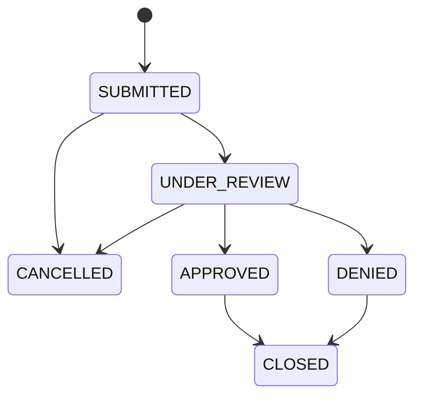
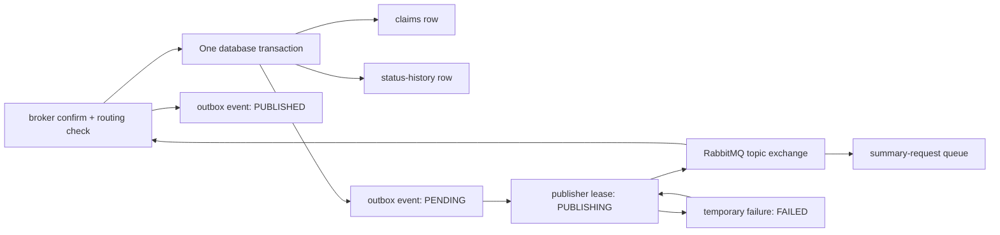
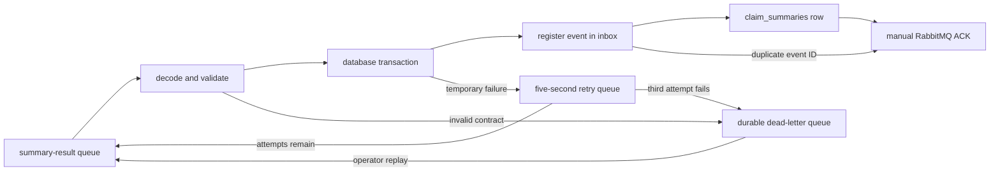

# Insurance Claims Integration Platform

A production-style learning project for submitting and processing synthetic insurance claims through REST APIs, PostgreSQL, RabbitMQ, and an AI-assisted review worker.

> This project uses synthetic data only. The AI component will summarize claim information and flag missing details for a human reviewer. It must never approve, deny, price, or determine coverage for a claim.

## Current edition

This edition includes two Spring Boot services and the foundation of a Python worker.
The claims service owns claim intake,
lifecycle rules, and durable PostgreSQL persistence. Before storing a new claim, it
calls a synthetic policy service to confirm that the policy is active, covers the
incident date, and covers the requested claim type. Accepted submissions also create
a pending, versioned integration event through a transactional outbox. A scheduled
publisher safely claims those events and publishes them to RabbitMQ with routing and
publisher-confirm checks before recording them as published. The claims service can
also consume a versioned synthetic summary result, validate and store it, and expose
that reviewer-assistance data without changing the claim's lifecycle status. Summary
consumption now includes delayed bounded retries, durable dead-letter storage,
transactional duplicate detection, and a disabled-by-default replay operation.
The FastAPI worker foundation defines the strict `claim.submitted.v1` input contract,
the future model-output schema, the fixed reviewer-assistance safety policy, and
liveness/readiness endpoints. RabbitMQ processing and model providers are the next
worker stories.

## Claim lifecycle



`CANCELLED` and `CLOSED` are terminal states. The domain model rejects every transition not shown above. Domain validation keeps these rules consistent regardless of whether a claim operation originates from REST, messaging, or a future administrative process.

## Repository layout

```text
services/
  claims-service/    Spring Boot REST API and claims orchestration
  policy-service/    Synthetic policy lookup and validation API
  claim-summary-worker/  Python/FastAPI reviewer-assistance worker
```

The policy service is deliberately separate: this makes the network boundary,
failure handling, and service contract visible instead of hiding policy rules inside
the claims application. Additional services, the Python worker, and the React portal
will be added when those versions are pushed.

## Prerequisites

- Java 17
- Docker Desktop with Docker Compose
- Node.js 24 LTS (for the later frontend edition)
- Python 3.12 and uv

Maven does not need to be installed globally. The claims service includes Maven Wrapper, which downloads and uses the project's configured Maven version.

## Build and test the services

Docker Desktop must be running because the integration tests start disposable
PostgreSQL and RabbitMQ containers with Testcontainers.

```bash
cd services/claims-service
./mvnw test

cd ../policy-service
../claims-service/mvnw -f pom.xml test
```

The policy service reuses the repository's Maven Wrapper executable while keeping
its own independent `pom.xml`. The tests cover domain rules, both HTTP APIs,
PostgreSQL persistence, the policy HTTP contract, correlation-ID propagation,
retry behavior, malformed upstream responses, and the circuit breaker.

Build and test the Python worker from the repository root:

```bash
cd services/claim-summary-worker
~/.local/bin/uv sync
~/.local/bin/uv run ruff check .
~/.local/bin/uv run ruff format --check .
~/.local/bin/uv run mypy
~/.local/bin/uv run pytest
```

The `.python-version` file makes `uv` select Python 3.12, and `uv.lock` pins the
complete dependency graph so local development and CI use the same package versions.

## Python worker foundation

The worker rejects unsupported event types and versions, mismatched aggregate and
claim IDs, unknown fields, invalid enum values, and event bodies over 64 KB. Its
model-facing input is an explicit allowlist containing only claim ID, type, incident
date, description, and estimated loss. Claimant name and policy number never cross
this boundary.

Claim descriptions are untrusted. They are passed as structured data and never
concatenated into the fixed system prompt, so text such as “ignore the rules” cannot
replace the worker's safety instructions. The strict output schema permits summaries,
missing-information lists, human-review queues, and safety flags—but no approval,
denial, pricing, or coverage decision.

Run the foundation API locally:

```bash
cd services/claim-summary-worker
~/.local/bin/uv run uvicorn claim_summary_worker.main:app --app-dir src --reload --port 8083
```

Check `http://localhost:8083/health/live` and
`http://localhost:8083/health/ready`. Interactive OpenAPI documentation is available
at `http://localhost:8083/docs`. Readiness currently proves that configuration and
the fixed safety policy loaded; the RabbitMQ worker story will extend it to broker
connectivity and consumer state.

## Run and manually verify both services

Create your ignored local environment file and choose a local-only database
password:

```bash
cp .env.example .env
```

Edit `.env`, replace both password placeholders, and then start PostgreSQL and
RabbitMQ:

```bash
docker compose up --detach --wait postgres rabbitmq
```

The RabbitMQ management UI is available at `http://localhost:15672`. Sign in with
the `RABBITMQ_USERNAME` and `RABBITMQ_PASSWORD` values from your local `.env` file.
These are credentials for this project's local RabbitMQ server; they are unrelated
to a Docker Hub login.

Start the policy service in a first terminal:

```bash
cd services/policy-service
../claims-service/mvnw -f pom.xml spring-boot:run
```

Its health endpoint is `http://localhost:8082/actuator/health`, and its Swagger UI
is `http://localhost:8082/swagger-ui.html`.

Docker Compose reads `.env` automatically. In a second terminal, export the same
variables for the Java process and start the claims service:

```bash
set -a
source .env
set +a
cd services/claims-service
./mvnw spring-boot:run
```

In a second terminal, request its health status:

```bash
curl --fail --silent http://localhost:8080/actuator/health
```

Expected response:

```json
{"groups":["liveness","readiness"],"status":"UP"}
```

The readiness probe can be checked independently at
`http://localhost:8080/actuator/health/readiness`. A platform such as Docker or
Kubernetes can use this signal to decide whether the service is ready to receive
traffic.

When finished, stop PostgreSQL and RabbitMQ from the repository root with
`docker compose down`. Named volumes keep their data for the next run. Running
`docker compose down --volumes` also deletes the local database and broker data and
should only be used when you intentionally want a clean reset.

## Synthetic policy catalog

The policy service keeps a small deterministic catalog in memory so local runs and
tests always produce the same result:

| Policy number | Active | Covered claim types | Coverage dates |
| --- | --- | --- | --- |
| `POL-AUTO-1001` | Yes | `AUTO` | 2025-01-01 through 2027-12-31 |
| `POL-HOME-2001` | Yes | `PROPERTY` | 2025-01-01 through 2027-12-31 |
| `POL-MULTI-3001` | Yes | `AUTO`, `PROPERTY` | 2025-01-01 through 2027-12-31 |
| `POL-INACTIVE-9001` | No | `AUTO` | 2025-01-01 through 2027-12-31 |

These records are synthetic learning data, not real customer policies. A production
system would replace the in-memory catalog with the insurer's policy system while
preserving the same application-facing contract.

## Submit a synthetic claim

With the claims service running, submit a claim from a second terminal:

```bash
curl --include \
  --request POST \
  --header 'Content-Type: application/json' \
  --header 'X-Correlation-ID: local-demo-1001' \
  --data '{
    "externalReference": "EXT-DEMO-1001",
    "policyNumber": "POL-AUTO-1001",
    "claimantName": "Synthetic Claimant",
    "claimType": "AUTO",
    "incidentDate": "2026-01-10",
    "description": "Synthetic vehicle damage for local testing",
    "estimatedLoss": 1250.00
  }' \
  http://localhost:8080/api/v1/claims
```

The response is `201 Created`, includes a `Location` header, and returns the new
claim with status `SUBMITTED`. Reusing the external reference, even with different
letter casing, returns `409 Conflict` as an RFC 9457 Problem Details response.

Using an unknown or inactive policy, an incident date outside its coverage window,
or a claim type it does not cover returns `422 Unprocessable Content`. The response
contains a stable rejection code such as `POLICY_NOT_FOUND` or
`CLAIM_TYPE_NOT_COVERED`. No claim or status-history row is stored when validation
fails.

The incoming `X-Correlation-ID` is forwarded to the policy service, allowing one
request to be followed across both applications. If the caller does not provide an
ID, the claims service generates one. Both services return the ID in their response.

For temporary network or policy-server failures, the claims service makes at most
three attempts with a short delay. It does not retry business rejections. Repeated
technical failures open a circuit breaker, which temporarily stops calls to an
unhealthy dependency. A dependency outage produces a sanitized `503 Service
Unavailable`; a structurally invalid policy response produces a sanitized `502 Bad
Gateway`. In both cases, nothing is persisted.

The default policy URL is `http://localhost:8082`. Override it for another
environment with `POLICY_SERVICE_BASE_URL`. Connect and read timeouts, retry limits,
and circuit-breaker thresholds live under `integration.policy` in the claims
service's `application.yml`.

Claims are stored in PostgreSQL and remain available after the claims-service or
database container restarts. Flyway applies versioned schema migrations at startup,
while Hibernate validates that the JPA mapping still agrees with the migrated
schema. PostgreSQL also enforces case-insensitive external-reference uniqueness.

## Transactional outbox

An accepted submission stores the claim, its initial audit-history row, and one
`claim.submitted` event in the same PostgreSQL transaction:



This solves the dual-write problem. If the application stored a claim and then sent
directly to RabbitMQ, a crash between those operations could leave a claim with no
event. The outbox makes PostgreSQL the single atomic boundary. The publisher can
repeatedly scan durable rows until RabbitMQ confirms delivery.

Each outbox row has a unique event ID, `claim.submitted` event type, version `1`,
claim aggregate ID, correlation ID, occurrence time, JSON payload, delivery status,
attempt count, and retry timestamps. The payload contains only the fields the future
summary worker needs. It omits claimant name and policy number to demonstrate data
minimization across service boundaries.

## RabbitMQ publication

The publisher polls in batches and atomically changes eligible rows from `PENDING`
or `FAILED` to `PUBLISHING`. PostgreSQL's `FOR UPDATE SKIP LOCKED` allows multiple
service instances to divide the work without waiting on each other's selected rows.
Each claim also receives a 15-second lease. If an instance crashes while it owns an
event, a later polling cycle can reclaim that expired `PUBLISHING` row.

The RabbitMQ contract is deliberately explicit:

| Component | Name | Purpose |
| --- | --- | --- |
| Durable topic exchange | `claims.events` | Receives versioned claims integration events |
| Routing key | `claim.submitted.v1` | Identifies the event type and contract version |
| Durable queue | `claim.summary.requests.v1` | Holds work for the future summary consumer |
| Routing key | `claim.summary.completed.v1` | Identifies a completed summary contract |
| Durable queue | `claim.summary.results.v1` | Holds summary results for the claims service |
| Durable topic exchange | `claims.retry` | Routes transiently failed summary results to a delay queue |
| Durable quorum queue | `claim.summary.results.retry.v1` | Delays a retry for five seconds before safely returning it to the results queue |
| Durable topic exchange | `claims.dead-letter` | Routes terminal and exhausted failures for investigation |
| Durable queue | `claim.summary.results.dlq.v1` | Preserves failed summary results until an operator replays them |

Messages are persistent and carry the event ID as the AMQP message ID, the request
correlation ID, event type and version, and aggregate metadata. The body is the exact
JSON envelope stored in the outbox; the publisher does not reconstruct or silently
change it.

Correlated publisher confirms prove that RabbitMQ accepted a message. Mandatory
publishing plus returned-message checks separately prove that the routing key reached
a queue. The outbox row becomes `PUBLISHED` only after both conditions hold. A
temporary failure becomes `FAILED` and is eligible again after five seconds.

This is an **at-least-once** design. A crash after RabbitMQ accepts a message but
before PostgreSQL records `PUBLISHED` can cause the same event ID to be sent again.
The summary-result consumer is therefore idempotent: it records processed event IDs
and treats a repeated ID as an acknowledged no-op.

After submitting the example claim, inspect publication state from the repository
root:

```bash
docker compose exec postgres psql \
  --username "$CLAIMS_DB_USERNAME" \
  --dbname "$CLAIMS_DB_NAME" \
  --command "SELECT event_type, event_version, status, attempt_count, published_at FROM outbox_events;"
```

For a healthy broker, the expected status is `PUBLISHED` with attempt count `1`.
Because no consumer exists yet, the message remains ready in the queue. Verify that
with:

```bash
docker compose exec rabbitmq rabbitmqctl list_queues \
  name durable messages_ready messages_unacknowledged
```

Duplicate or rejected claims do not produce outbox events. If event insertion fails,
the claim and history insert are rolled back with it.

## RabbitMQ summary-result consumption

The claims service listens to `claim.summary.results.v1` with manual acknowledgments.
Each result must use the `claim.summary.completed` event type and version `1`. The
envelope aggregate ID must match the payload claim ID, and all required summary
fields must pass schema validation before the application service is called.

The processing order is important:



The acknowledgment happens only after the transactional service returns, so a
database failure cannot silently discard the message. The inbox event ID and summary
are written in that same transaction. If summary storage fails, the inbox insert is
rolled back; if RabbitMQ redelivers an already committed event, the primary key makes
the second delivery a no-op. The summary table stores the source event ID, generated
and received timestamps, summary text, missing-information list, recommended
human-review queue, and safety flags. A newer generated result can replace an older
one; an older late-arriving result cannot overwrite newer data.

Transient failures receive at most three total processing attempts, separated by a
five-second broker delay. Invalid contracts, unknown claims, and failures that exhaust
the attempt limit are published to `claim.summary.results.dlq.v1`. The original
delivery is acknowledged only after RabbitMQ confirms that the retry or dead-letter
copy was accepted and routed. If that publication cannot be confirmed, the original
delivery is requeued instead of being lost. Message bodies and exception details are
not written to application logs.

The supported review queues are `STANDARD_REVIEW`, `COMPLEX_REVIEW`, and
`SPECIALIST_REVIEW`. These are routing suggestions for people, not claim decisions.
The consumer never approves, denies, prices, or determines coverage for a claim.

Until the Python worker is added, simulate its completed event through RabbitMQ's
local management API. Set `CLAIM_ID` to the ID returned by claim submission:

```bash
CLAIM_ID="replace-with-the-created-claim-id"
EVENT_ID="$(uuidgen | tr '[:upper:]' '[:lower:]')"
GENERATED_AT="$(date -u +%Y-%m-%dT%H:%M:%SZ)"

summary_event="$(jq -nc \
  --arg eventId "$EVENT_ID" \
  --arg claimId "$CLAIM_ID" \
  --arg occurredAt "$GENERATED_AT" \
  '{
    eventId: $eventId,
    eventType: "claim.summary.completed",
    eventVersion: 1,
    aggregateType: "claim",
    aggregateId: $claimId,
    correlationId: "local-summary-demo-1001",
    occurredAt: $occurredAt,
    data: {
      claimId: $claimId,
      summary: "Synthetic vehicle damage requires human review.",
      missingInformation: ["Police report"],
      recommendedHumanReviewQueue: "STANDARD_REVIEW",
      safetyFlags: [],
      generatedAt: $occurredAt
    }
  }')"

jq -nc --arg payload "$summary_event" '{
  properties: {delivery_mode: 2},
  routing_key: "claim.summary.completed.v1",
  payload: $payload,
  payload_encoding: "string"
}' | curl --fail --silent --show-error \
  --user "$RABBITMQ_USERNAME:$RABBITMQ_PASSWORD" \
  --header 'Content-Type: application/json' \
  --data-binary @- \
  http://localhost:15672/api/exchanges/%2F/claims.events/publish
```

The management API responds with `{"routed":true}`. Then retrieve the stored result:

```bash
curl --silent "http://localhost:8080/api/v1/claims/$CLAIM_ID/summary"
```

An existing claim without a result returns a `404` Problem Details response with
type `urn:problem:claim-summary-not-found`.

### Controlled dead-letter replay

Replay is off by default. First fix the reason messages failed and inspect the
dead-letter queue in RabbitMQ. For a local, temporary maintenance session, restart
the claims service with both the replay feature and its Actuator web exposure enabled:

```bash
export DEAD_LETTER_REPLAY_ENABLED=true
export MANAGEMENT_ENDPOINTS_WEB_EXPOSURE_INCLUDE=health,info,deadLetterReplay
./mvnw spring-boot:run
```

Replay a bounded batch (between 1 and 100 messages):

```bash
curl --fail --silent --show-error \
  --request POST \
  --header 'Content-Type: application/json' \
  --data '{"limit":10}' \
  http://localhost:8080/actuator/deadLetterReplay
```

Each dead-letter message is acknowledged only after its publication back to
`claims.events` is broker-confirmed. Replay removes the old retry/failure headers and
adds a `replayedAt` timestamp. Disable the flag and remove the endpoint from exposure
after maintenance. This local learning setup does not yet have endpoint authentication;
production deployment must protect administrative Actuator operations with strong
authentication and authorization.

## Retrieve and browse claims

Use the `id` returned by claim submission to retrieve that claim:

```bash
curl --silent \
  --header 'X-Correlation-ID: local-demo-get-1001' \
  http://localhost:8080/api/v1/claims/{id}
```

An unknown claim ID returns `404 Not Found` as a Problem Details response. Browse
claims with zero-based pagination and optional `status` and `claimType` filters:

```bash
curl --silent \
  'http://localhost:8080/api/v1/claims?page=0&size=20&status=SUBMITTED&claimType=AUTO'
```

The default page is `0`, the default size is `20`, and the maximum size is `100`.
Results are ordered newest first. The response includes `totalElements` and
`totalPages` so clients can build pagination controls without loading every claim.

## Transition claim status and view history

Request a lifecycle transition with the claim ID returned by submission:

```bash
curl --silent \
  --request PATCH \
  --header 'Content-Type: application/json' \
  --header 'X-Correlation-ID: local-status-1001' \
  --data '{"status":"UNDER_REVIEW"}' \
  http://localhost:8080/api/v1/claims/{id}/status
```

The domain lifecycle shown above determines whether the transition is allowed. For
example, `SUBMITTED` can become `UNDER_REVIEW` or `CANCELLED`, but it cannot become
`APPROVED` directly. An invalid transition returns `409 Conflict` and does not
change the claim or append history.

Retrieve the oldest-to-newest audit trail:

```bash
curl --silent http://localhost:8080/api/v1/claims/{id}/history
```

Every claim starts with an initial history record whose `previousStatus` is `null`
and `newStatus` is `SUBMITTED`. Each valid transition updates the claim and inserts
its history row in one database transaction. Optimistic locking prevents concurrent
reviewers from silently overwriting one another.

Claims OpenAPI JSON is available at `http://localhost:8080/v3/api-docs`, and its
interactive Swagger UI is available at `http://localhost:8080/swagger-ui.html`.
