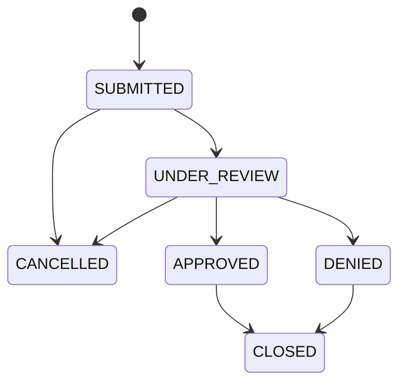

# Insurance Claims Integration Platform

A production-style learning project for submitting and processing synthetic insurance claims through REST APIs, PostgreSQL, RabbitMQ, and an AI-assisted review worker.

> This project uses synthetic data only. The AI component will summarize claim information and flag missing details for a human reviewer. It must never approve, deny, price, or determine coverage for a claim.

## Current edition

This edition establishes the Spring Boot claims-service foundation. The service starts, exposes operational health information, and contains the framework-independent claim domain model. HTTP claim endpoints and persistence will be added in focused follow-up stories.

## Claim lifecycle



`CANCELLED` and `CLOSED` are terminal states. The domain model rejects every transition not shown above. Domain validation keeps these rules consistent regardless of whether a claim operation originates from REST, messaging, or a future administrative process.

## Repository layout

```text
services/
  claims-service/    Spring Boot REST API and claims orchestration
```

Additional services, the Python worker, and the React portal will be added only when their milestones begin.

## Prerequisites

- Java 17
- Docker Desktop with Docker Compose
- Node.js 24 LTS (for the later frontend milestone)
- Python 3.12 and uv (for the later worker milestone)

Maven does not need to be installed globally. The claims service includes Maven Wrapper, which downloads and uses the project's configured Maven version.

## Build and test the claims service

```bash
cd services/claims-service
./mvnw test
```

## Run and manually verify the claims service

Start the application:

```bash
cd services/claims-service
./mvnw spring-boot:run
```

In a second terminal, request its health status:

```bash
curl --fail --silent http://localhost:8080/actuator/health
```

Expected response:

```json
{"groups":["liveness","readiness"],"status":"UP"}
```

The readiness probe can be checked independently at
`http://localhost:8080/actuator/health/readiness`. A platform such as Docker or
Kubernetes can use this signal to decide whether the service is ready to receive
traffic.
