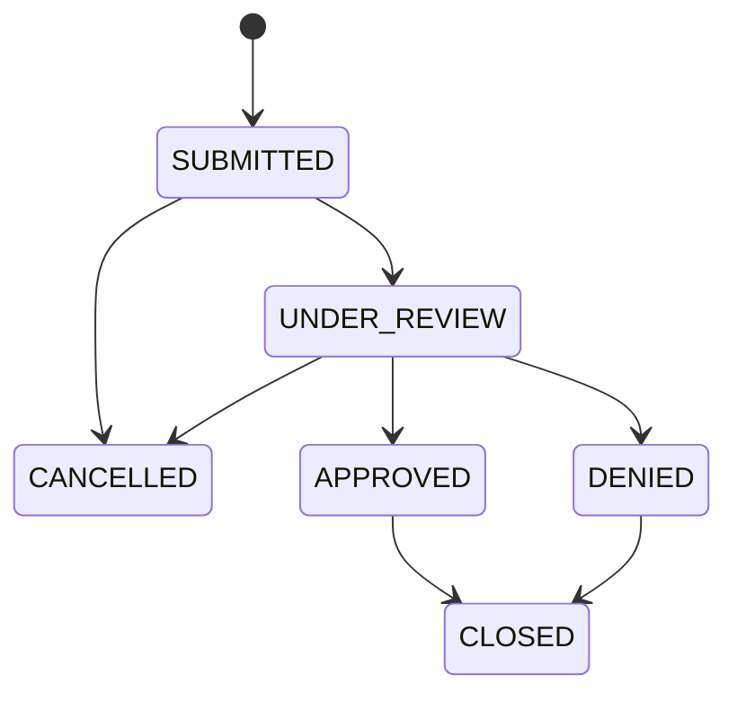
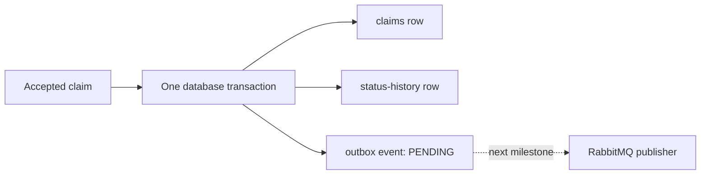

# Insurance Claims Integration Platform

A production-style learning project for submitting and processing synthetic insurance claims through REST APIs, PostgreSQL, RabbitMQ, and an AI-assisted review worker.

> This project uses synthetic data only. The AI component will summarize claim information and flag missing details for a human reviewer. It must never approve, deny, price, or determine coverage for a claim.

## Current edition

This edition includes two Spring Boot services. The claims service owns claim intake,
lifecycle rules, and durable PostgreSQL persistence. Before storing a new claim, it
calls a synthetic policy service to confirm that the policy is active, covers the
incident date, and covers the requested claim type. Accepted submissions also create
a pending, versioned integration event through a transactional outbox.

## Claim lifecycle



`CANCELLED` and `CLOSED` are terminal states. The domain model rejects every transition not shown above. Domain validation keeps these rules consistent regardless of whether a claim operation originates from REST, messaging, or a future administrative process.

## Repository layout

```text
services/
  claims-service/    Spring Boot REST API and claims orchestration
  policy-service/    Synthetic policy lookup and validation API
```

The policy service is deliberately separate: this makes the network boundary,
failure handling, and service contract visible instead of hiding policy rules inside
the claims application. Additional services, the Python worker, and the React portal
will be added only when their milestones begin.

## Prerequisites

- Java 17
- Docker Desktop with Docker Compose
- Node.js 24 LTS (for the later frontend milestone)
- Python 3.12 and uv (for the later worker milestone)

Maven does not need to be installed globally. The claims service includes Maven Wrapper, which downloads and uses the project's configured Maven version.

## Build and test the services

Docker Desktop must be running because the persistence integration test starts a
disposable PostgreSQL container with Testcontainers.

```bash
cd services/claims-service
./mvnw test

cd ../policy-service
../claims-service/mvnw -f pom.xml test
```

The policy service reuses the repository's Maven Wrapper executable while keeping
its own independent `pom.xml`. The tests cover domain rules, both HTTP APIs,
PostgreSQL persistence, the policy HTTP contract, correlation-ID propagation,
retry behavior, malformed upstream responses, and the circuit breaker.

## Run and manually verify both services

Create your ignored local environment file and choose a local-only database
password:

```bash
cp .env.example .env
```

Edit `.env`, replace `replace-with-a-local-password`, and then start PostgreSQL:

```bash
docker compose up --detach --wait postgres
```

Start the policy service in a first terminal:

```bash
cd services/policy-service
../claims-service/mvnw -f pom.xml spring-boot:run
```

Its health endpoint is `http://localhost:8082/actuator/health`, and its Swagger UI
is `http://localhost:8082/swagger-ui.html`.

Docker Compose reads `.env` automatically. In a second terminal, export the same
variables for the Java process and start the claims service:

```bash
set -a
source .env
set +a
cd services/claims-service
./mvnw spring-boot:run
```

In a second terminal, request its health status:

```bash
curl --fail --silent http://localhost:8080/actuator/health
```

Expected response:

```json
{"groups":["liveness","readiness"],"status":"UP"}
```

The readiness probe can be checked independently at
`http://localhost:8080/actuator/health/readiness`. A platform such as Docker or
Kubernetes can use this signal to decide whether the service is ready to receive
traffic.

When finished, stop PostgreSQL from the repository root with `docker compose down`.
The named volume keeps the data for the next run. Running
`docker compose down --volumes` also deletes the local database and should only be
used when you intentionally want a clean reset.

## Synthetic policy catalog

The policy service keeps a small deterministic catalog in memory so local runs and
tests always produce the same result:

| Policy number | Active | Covered claim types | Coverage dates |
| --- | --- | --- | --- |
| `POL-AUTO-1001` | Yes | `AUTO` | 2025-01-01 through 2027-12-31 |
| `POL-HOME-2001` | Yes | `PROPERTY` | 2025-01-01 through 2027-12-31 |
| `POL-MULTI-3001` | Yes | `AUTO`, `PROPERTY` | 2025-01-01 through 2027-12-31 |
| `POL-INACTIVE-9001` | No | `AUTO` | 2025-01-01 through 2027-12-31 |

These records are synthetic learning data, not real customer policies. A production
system would replace the in-memory catalog with the insurer's policy system while
preserving the same application-facing contract.

## Submit a synthetic claim

With the claims service running, submit a claim from a second terminal:

```bash
curl --include \
  --request POST \
  --header 'Content-Type: application/json' \
  --header 'X-Correlation-ID: local-demo-1001' \
  --data '{
    "externalReference": "EXT-DEMO-1001",
    "policyNumber": "POL-AUTO-1001",
    "claimantName": "Synthetic Claimant",
    "claimType": "AUTO",
    "incidentDate": "2026-01-10",
    "description": "Synthetic vehicle damage for local testing",
    "estimatedLoss": 1250.00
  }' \
  http://localhost:8080/api/v1/claims
```

The response is `201 Created`, includes a `Location` header, and returns the new
claim with status `SUBMITTED`. Reusing the external reference, even with different
letter casing, returns `409 Conflict` as an RFC 9457 Problem Details response.

Using an unknown or inactive policy, an incident date outside its coverage window,
or a claim type it does not cover returns `422 Unprocessable Content`. The response
contains a stable rejection code such as `POLICY_NOT_FOUND` or
`CLAIM_TYPE_NOT_COVERED`. No claim or status-history row is stored when validation
fails.

The incoming `X-Correlation-ID` is forwarded to the policy service, allowing one
request to be followed across both applications. If the caller does not provide an
ID, the claims service generates one. Both services return the ID in their response.

For temporary network or policy-server failures, the claims service makes at most
three attempts with a short delay. It does not retry business rejections. Repeated
technical failures open a circuit breaker, which temporarily stops calls to an
unhealthy dependency. A dependency outage produces a sanitized `503 Service
Unavailable`; a structurally invalid policy response produces a sanitized `502 Bad
Gateway`. In both cases, nothing is persisted.

The default policy URL is `http://localhost:8082`. Override it for another
environment with `POLICY_SERVICE_BASE_URL`. Connect and read timeouts, retry limits,
and circuit-breaker thresholds live under `integration.policy` in the claims
service's `application.yml`.

Claims are stored in PostgreSQL and remain available after the claims-service or
database container restarts. Flyway applies versioned schema migrations at startup,
while Hibernate validates that the JPA mapping still agrees with the migrated
schema. PostgreSQL also enforces case-insensitive external-reference uniqueness.

## Transactional outbox

An accepted submission stores the claim, its initial audit-history row, and one
`claim.submitted` event in the same PostgreSQL transaction:



This solves the dual-write problem. If the application stored a claim and then sent
directly to RabbitMQ, a crash between those operations could leave a claim with no
event. The outbox makes PostgreSQL the single atomic boundary. A later publisher can
repeatedly scan durable pending rows until RabbitMQ confirms delivery.

Each outbox row has a unique event ID, `claim.submitted` event type, version `1`,
claim aggregate ID, correlation ID, occurrence time, JSON payload, delivery status,
attempt count, and retry timestamps. The payload contains only the fields the future
summary worker needs. It omits claimant name and policy number to demonstrate data
minimization across service boundaries.

After submitting the example claim, inspect its pending event from the repository
root:

```bash
docker compose exec postgres psql \
  --username "$CLAIMS_DB_USERNAME" \
  --dbname "$CLAIMS_DB_NAME" \
  --command "SELECT event_type, event_version, status, attempt_count, aggregate_id FROM outbox_events;"
```

At this milestone, `PENDING` is the expected status: RabbitMQ publication is
intentionally implemented in the next bounded story. Duplicate or rejected claims
do not produce outbox events. If event insertion fails, the claim and history insert
are rolled back with it.

## Retrieve and browse claims

Use the `id` returned by claim submission to retrieve that claim:

```bash
curl --silent \
  --header 'X-Correlation-ID: local-demo-get-1001' \
  http://localhost:8080/api/v1/claims/{id}
```

An unknown claim ID returns `404 Not Found` as a Problem Details response. Browse
claims with zero-based pagination and optional `status` and `claimType` filters:

```bash
curl --silent \
  'http://localhost:8080/api/v1/claims?page=0&size=20&status=SUBMITTED&claimType=AUTO'
```

The default page is `0`, the default size is `20`, and the maximum size is `100`.
Results are ordered newest first. The response includes `totalElements` and
`totalPages` so clients can build pagination controls without loading every claim.

## Transition claim status and view history

Request a lifecycle transition with the claim ID returned by submission:

```bash
curl --silent \
  --request PATCH \
  --header 'Content-Type: application/json' \
  --header 'X-Correlation-ID: local-status-1001' \
  --data '{"status":"UNDER_REVIEW"}' \
  http://localhost:8080/api/v1/claims/{id}/status
```

The domain lifecycle shown above determines whether the transition is allowed. For
example, `SUBMITTED` can become `UNDER_REVIEW` or `CANCELLED`, but it cannot become
`APPROVED` directly. An invalid transition returns `409 Conflict` and does not
change the claim or append history.

Retrieve the oldest-to-newest audit trail:

```bash
curl --silent http://localhost:8080/api/v1/claims/{id}/history
```

Every claim starts with an initial history record whose `previousStatus` is `null`
and `newStatus` is `SUBMITTED`. Each valid transition updates the claim and inserts
its history row in one database transaction. Optimistic locking prevents concurrent
reviewers from silently overwriting one another.

Claims OpenAPI JSON is available at `http://localhost:8080/v3/api-docs`, and its
interactive Swagger UI is available at `http://localhost:8080/swagger-ui.html`.
